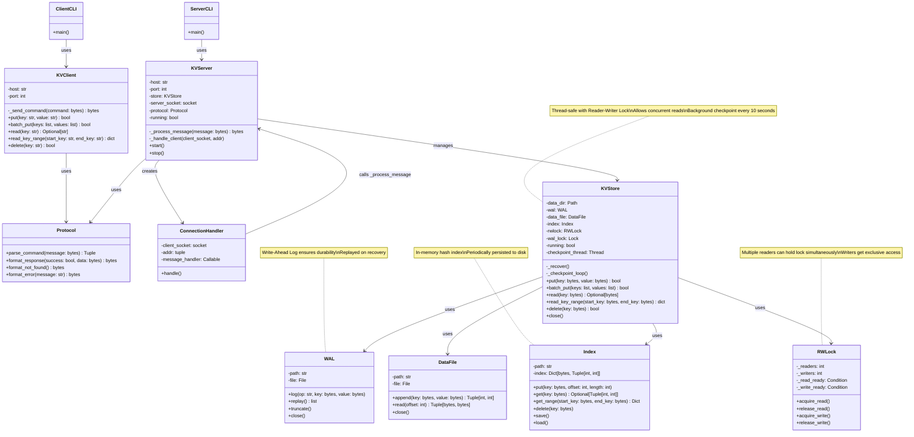
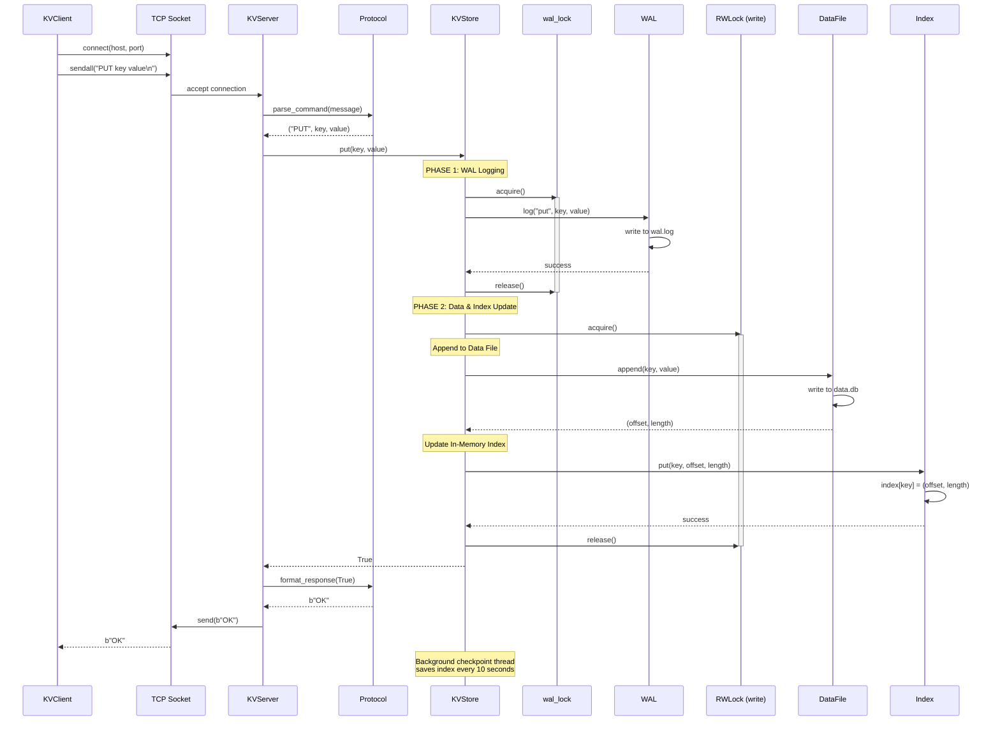
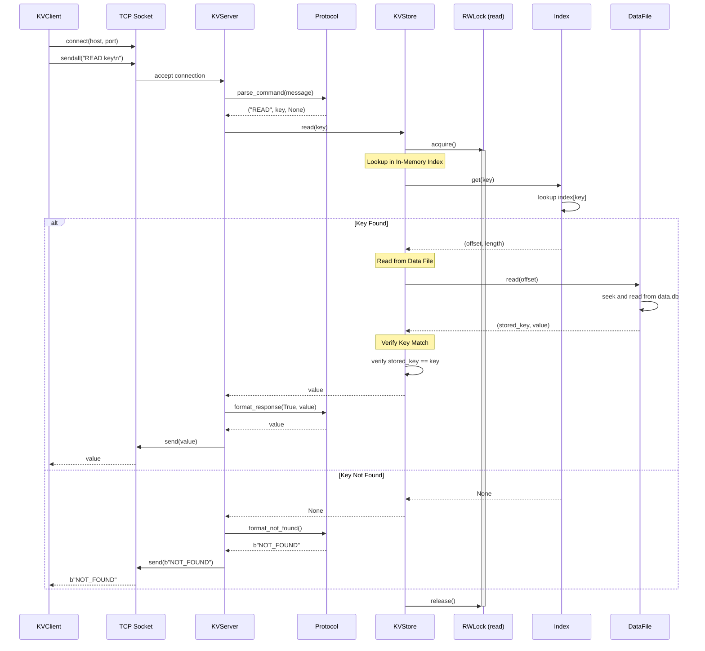
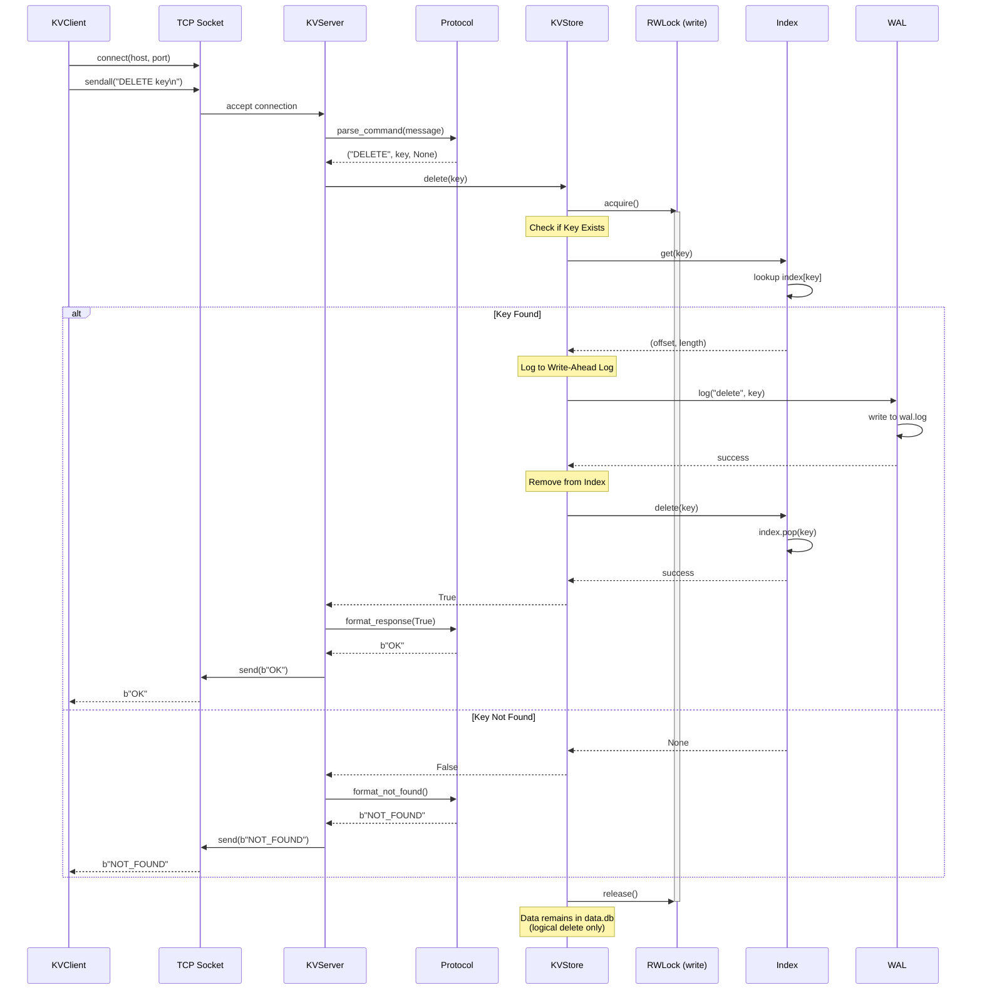

# kvstore

A high-performance, thread-safe key-value store with Write-Ahead Logging (WAL) and network interface.

## Features

- **Thread-safe operations**: True concurrent reads with exclusive writes using Reader-Wr    %% Notes
    note for KVStore "Two-phase locking strategy:\\nwal_lock for WAL writes\\nrwlock for data/index access\\nAllows concurrent reads\\nBackground checkpoint every 10 seconds"
    note for RWLock "Multiple readers can hold lock simultaneously\\nWriters get exclusive access"
    note for WAL "Write-Ahead Log ensures durability\\nReplayed on recovery\\nHas separate lock for better concurrency"
    note for Index "In-memory hash index\\nPeriodically persisted to disk"Lock
- **Two-phase locking**: Separate WAL lock prevents write starvation in read-heavy workloads
- **Write-Ahead Logging (WAL)**: Ensures durability and crash recovery
- **In-memory indexing**: Fast lookups with periodic persistence
- **Background checkpointing**: Automatic index saves every 10 seconds
- **Network protocol**: Simple TCP-based text protocol
- **Batch operations**: Efficient bulk insertions with `batchput`
- **Range queries**: Retrieve multiple key-value pairs with `readrange`
- **Graceful shutdown**: Ctrl+C handling with proper cleanup
- **Concurrent reads**: Multiple clients can read simultaneously without blocking each other
- **Write optimization**: WAL writes don't wait for readers to finish

## Install and run
From project root
```
pip install -e .
```

Run server
```
python -m kvstore.cli.server_cli
```

Run client command
```
python -m kvstore.cli.client_cli put <key> <value>
python -m kvstore.cli.client_cli batchput <key1,key2,...> <val1,val2,...>
python -m kvstore.cli.client_cli read <key>
python -m kvstore.cli.client_cli readrange <start_key> <end_key>
python -m kvstore.cli.client_cli delete <key>
```

## Protocol

**Commands:**
- `PUT <key> <value>` - Store a key-value pair
- `BATCHPUT <key1,key2,...,keyN> <val1,val2,...,valN>` - Store multiple pairs
- `READ <key>` - Retrieve value for key
- `READRANGE <start_key> <end_key>` - Retrieve all keys in range [start, end]
- `DELETE <key>` - Remove key

**Responses:**
- `OK` - Operation successful
- `<value>` - Value for READ command
- set of `<key: value>` - Results for READRANGE
- `NOT_FOUND` - Key not found
- `ERROR: <message>` - Error occurred

## Architecture Details

### Core Components

1. **KVStore**: Main store orchestrating WAL, DataFile, and Index
2. **WAL (Write-Ahead Log)**: Logs all write operations before applying them
3. **DataFile**: Append-only storage file for key-value pairs
4. **Index**: In-memory hash map for fast key lookups

### Locking Strategy

The system uses a sophisticated **two-phase locking strategy** to optimize performance:

#### 1. Reader-Writer Lock (RWLock)
- **Read operations**: Multiple readers can acquire the lock simultaneously
- **Write operations**: Writers get exclusive access (no readers or other writers)
- **Use case**: Protects data file reads/writes and index updates

#### 2. Separate WAL Lock
- **Independent locking**: WAL writes use a separate `threading.Lock()`
- **Problem solved**: In read-heavy workloads, writers would wait for all readers to finish before even logging to WAL
- **Benefit**: WAL writes can proceed immediately without waiting for readers

#### Write Operation Flow (Two-Phase):
```
Phase 1: Acquire wal_lock → Log to WAL → Release wal_lock
Phase 2: Acquire write_lock → Update DataFile & Index → Release write_lock
```

**Why this matters:**
- In a read-heavy workload, many readers might be active
- Without separate locks: Writer waits for readers → WAL logging delayed → Other writers blocked
- With separate locks: WAL logging proceeds immediately → Better write throughput
- Durability preserved: WAL is written before data/index updates

### Network Components

1. **KVServer**: Multi-threaded TCP server handling client connections
2. **KVClient**: Client library for connecting to the server
3. **Protocol**: Message parsing and formatting
4. **ConnectionHandler**: Per-connection request handler

### Architecture Diagram



### Data Flow

**Write Operation:**
```
Client → Protocol → Server → KVStore → WAL → DataFile → Index
```

**Read Operation:**
```
Client → Protocol → Server → KVStore → Index → DataFile → Client
```

**Recovery on Startup:**
```
KVStore → WAL.replay() → Apply operations → Truncate WAL
```

### Write Operation Sequence Diagram



**Key Steps:**

1. **Phase 1 - WAL Lock**: Acquire wal_lock (fast, doesn't wait for readers)
2. **WAL Logging**: Write operation to WAL first (durability guarantee)
3. **Release WAL Lock**: Other writers can now log to WAL
4. **Phase 2 - Write Lock**: Acquire exclusive write lock (waits for readers to finish)
5. **Data Append**: Append key-value to append-only data file
6. **Index Update**: Update in-memory index with offset/length
7. **Release Write Lock**: Readers and other writers can now proceed
8. **Response**: Return success to client

**Two-Phase Locking Benefits:**
- **Read-heavy optimization**: WAL writes don't wait for readers
- **Better write throughput**: Multiple writers can log to WAL concurrently (sequential, but not blocked by readers)
- **Durability preserved**: WAL is always written before data/index updates
- **Prevents write starvation**: Writers can make progress even with many active readers

**Crash Recovery:**
- If crash occurs after WAL log but before index update
- On restart: WAL is replayed to rebuild index
- Ensures no data loss

### Read Operation Sequence Diagram



**Key Steps:**

1. **Lock Acquisition**: Acquire read lock (allows concurrent reads - multiple readers simultaneously)
2. **Index Lookup**: Fast O(1) lookup in in-memory hash index
3. **Get Offset**: Retrieve file offset and length for the key
4. **Data Read**: Seek to offset and read from data file
5. **Verification**: Verify stored key matches requested key
6. **Lock Release**: Release read lock
7. **Response**: Return value or NOT_FOUND to client

**Performance Characteristics:**
- **Fast lookups**: O(1) index lookup in memory
- **True concurrent reads**: Multiple readers can hold the lock simultaneously (Reader-Writer Lock)
- **Non-blocking reads**: Read operations don't block each other
- **Single disk seek**: Direct access via offset, no scanning
- **Key verification**: Extra safety check after reading from disk

### Delete Operation Sequence Diagram



**Key Steps:**

1. **Lock Acquisition**: Acquire exclusive write lock for thread safety
2. **Existence Check**: Check if key exists in index
3. **WAL Logging**: Log delete operation to WAL (for crash recovery)
4. **Index Removal**: Remove key from in-memory index
5. **Lock Release**: Release write lock
6. **Response**: Return OK or NOT_FOUND to client

**Important Notes:**
- **Logical Delete**: Data is NOT removed from the data file (append-only)
- **Index Only**: Only the index entry is removed
- **Space Reclamation**: Deleted data remains on disk (could be compacted later)
- **Fast Operation**: No disk I/O needed except WAL log
- **Crash Recovery**: WAL ensures delete is replayed after crash


