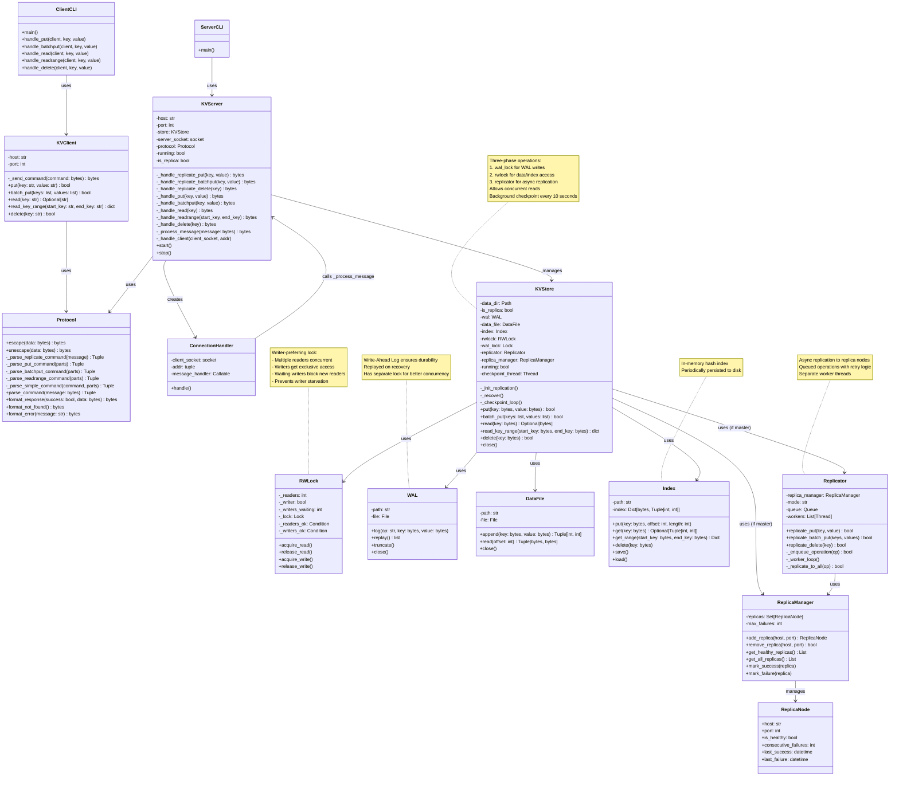
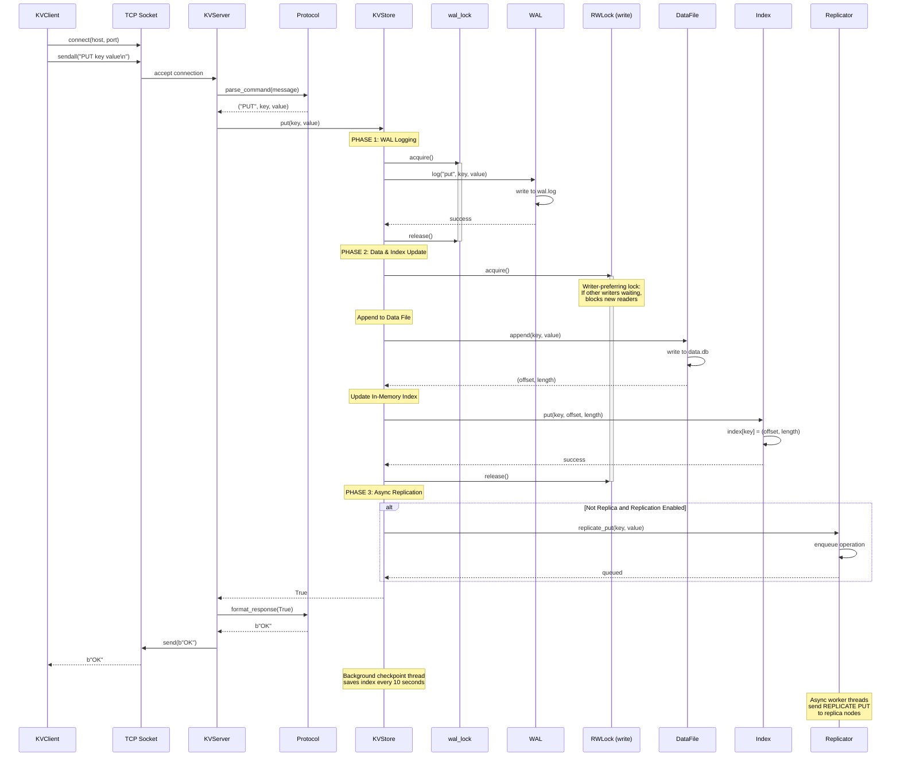
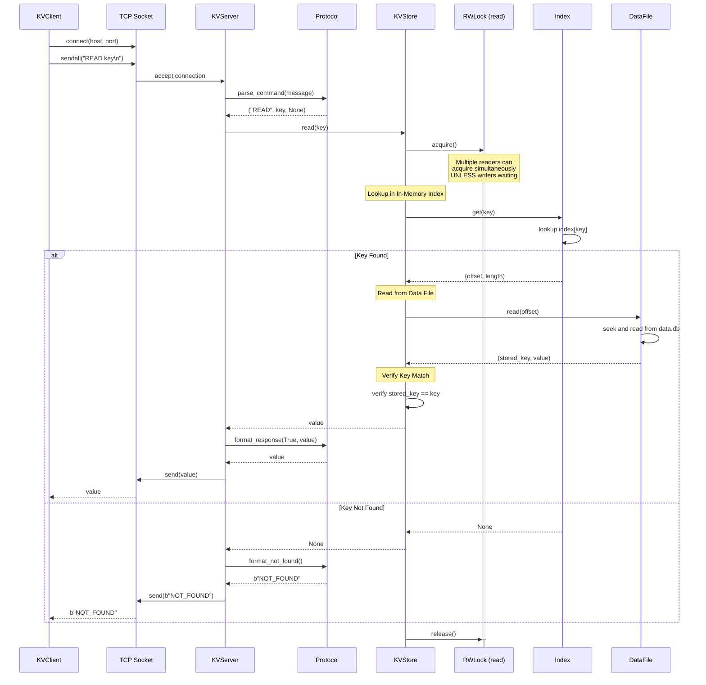
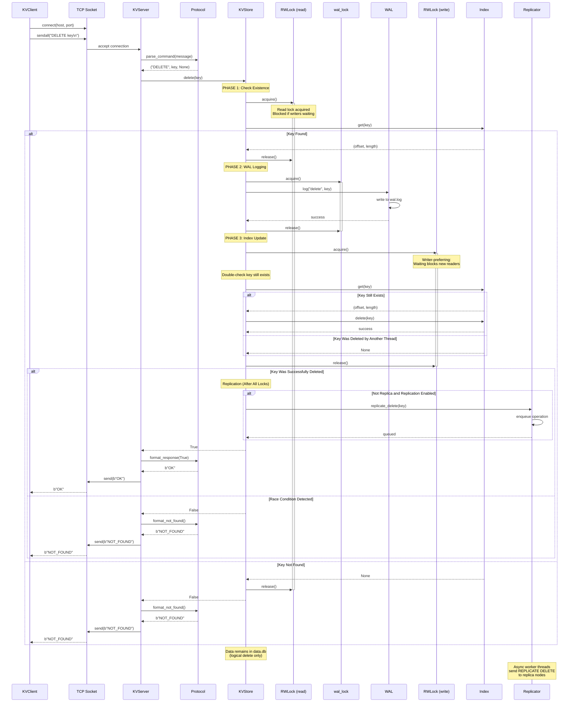
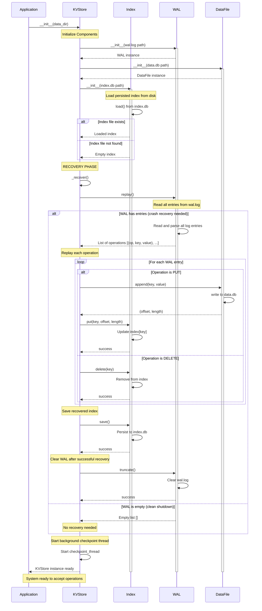

# Architecture Details

## System Components

### Storage Layer
1. **KVStore**: Main store orchestrating WAL, DataFile, and Index
2. **WAL (Write-Ahead Log)**: Logs all write operations before applying them
3. **DataFile**: Append-only storage file for key-value pairs
4. **Index**: In-memory hash map for fast key lookups

### Network Layer
5. **KVServer**: Multi-threaded TCP server handling client connections
6. **KVClient**: Client library for connecting to the server
7. **Protocol**: Message parsing and formatting
8. **ConnectionHandler**: Per-connection request handler

### Replication Layer
9. **Replicator**: Handles asynchronous replication to replica nodes
10. **ReplicaManager**: Manages replica nodes and their health status
11. **ReplicaNode**: Represents individual replica servers

### Synchronization
12. **RWLock**: Reader-Writer lock allowing concurrent reads

## Architecture Diagram



## Write Operation Sequence Diagram



**Key Steps:**

1. **Phase 1 - WAL Lock**: Acquire wal_lock (fast, doesn't wait for readers)
2. **WAL Logging**: Write operation to WAL first (durability guarantee)
3. **Release WAL Lock**: Other writers can now log to WAL
4. **Phase 2 - Write Lock**: Acquire exclusive write lock (waits for readers to finish)
5. **Data Append**: Append key-value to append-only data file
6. **Index Update**: Update in-memory index with offset/length
7. **Release Write Lock**: Readers and other writers can now proceed
8. **Phase 3 - Replication**: Async replication to replicas (non-blocking)
9. **Response**: Return success to client

**Three-Phase Locking Benefits:**
- **Read-heavy optimization**: WAL writes don't wait for readers
- **Better write throughput**: Multiple writers can log to WAL concurrently (sequential, but not blocked by readers)
- **Durability preserved**: WAL is always written before data/index updates
- **Prevents write starvation**: Writers can make progress even with many active readers
- **Async replication**: Replication doesn't block write response to client

**Crash Recovery:**
- If crash occurs after WAL log but before index update
- On restart: WAL is replayed to rebuild index
- Ensures no data loss
- Replicas eventually consistent via async replication

## Read Operation Sequence Diagram



**Key Steps:**

1. **Lock Acquisition**: Acquire read lock (allows concurrent reads - multiple readers simultaneously, blocked if writers waiting)
2. **Index Lookup**: Fast O(1) lookup in in-memory hash index
3. **Get Offset**: Retrieve file offset and length for the key
4. **Data Read**: Seek to offset and read from data file
5. **Verification**: Verify stored key matches requested key
6. **Lock Release**: Release read lock
7. **Response**: Return value or NOT_FOUND to client

**Performance Characteristics:**
- **Fast lookups**: O(1) index lookup in memory
- **True concurrent reads**: Multiple readers can hold the lock simultaneously (Reader-Writer Lock)
- **Writer-preferring**: New readers blocked when writers are waiting (prevents writer starvation)
- **Non-blocking reads**: Read operations don't block each other (when no writers waiting)
- **Single disk seek**: Direct access via offset, no scanning
- **Key verification**: Extra safety check after reading from disk

## Delete Operation Sequence Diagram



**Key Steps:**

1. **Phase 1 - Read Lock**: Check if key exists (allows concurrent reads, blocked if writers waiting)
   - If not found: Release lock and return NOT_FOUND immediately
2. **Phase 2 - WAL Lock**: Log delete operation to WAL (doesn't wait for readers)
3. **Release WAL Lock**: Other writers can now log to WAL
4. **Phase 3 - Write Lock**: Acquire exclusive write lock (waiting blocks new readers - writer-preferring)
5. **Double Check**: Verify key still exists (race condition protection)
   - If deleted by another thread: Release lock and return NOT_FOUND
6. **Index Removal**: Remove key from in-memory index
7. **Release Write Lock**: Readers and other writers can now proceed
8. **Async Replication**: Enqueue delete operation for replica nodes (if master)
9. **Response**: Return OK to client (replication happens asynchronously)

**Three-Phase Locking Benefits:**
- **Optimistic existence check**: Read lock first (fast, concurrent, but blocked if writers waiting)
- **Early exit**: Return immediately if key doesn't exist (no WAL/write lock needed)
- **WAL logging without blocking**: Separate lock for durability
- **Race condition safety**: Double-check under write lock
- **Writer-preferring**: Delete operations don't starve under read load
- **Async replication**: Non-blocking replication after all locks released

**Important Notes:**
- **Logical Delete**: Data is NOT removed from the data file (append-only)
- **Index Only**: Only the index entry is removed
- **Space Reclamation**: Deleted data remains on disk (could be compacted later)
- **Fast Operation**: No disk I/O needed except WAL log
- **Crash Recovery**: WAL ensures delete is replayed after crash
- **Replication**: Delete propagates to replica nodes asynchronously

## Recovery on Startup Sequence Diagram



**Recovery Process:**

1. **Component Initialization**: Create WAL, DataFile, and Index instances
2. **Load Persisted Index**: Load the last checkpointed index from `index.db`
3. **Check WAL**: Read all entries from `wal.log`
4. **Replay Operations**: If WAL has entries (crash occurred):
   - For each PUT: Append to data file and update index
   - For each DELETE: Remove from index
5. **Save Index**: Persist the recovered index to disk
6. **Truncate WAL**: Clear the WAL since all operations are now in the index
7. **Start Checkpoint Thread**: Begin periodic index persistence

**Recovery Scenarios:**

- **Clean Shutdown**: WAL is empty, index is up-to-date → No replay needed
- **Crash After WAL Write**: Operations in WAL but not in index → Replay all WAL entries
- **Crash During Checkpoint**: Some operations in WAL, some in index → Replay all (idempotent for PUTs)

**Durability Guarantees:**

- **WAL First**: All operations are logged to WAL before data/index updates
- **Crash Recovery**: On restart, WAL is replayed to restore state
- **No Data Loss**: Any operation that was logged to WAL is guaranteed to be recovered
- **Idempotent Replay**: PUT operations can be replayed multiple times safely
- **Index Consistency**: Index always reflects all operations that made it to WAL

## Locking Strategy

The system uses a sophisticated **three-phase locking strategy** to optimize performance:

### 1. Reader-Writer Lock (RWLock)

**Implementation**: Writer-preferring lock that prevents writer starvation

**Behavior**:
- **Read operations**: Multiple readers can acquire the lock simultaneously
- **Write operations**: Writers get exclusive access (no readers or other writers)
- **Writer priority**: When a writer is waiting, new readers are blocked until the writer completes
- **Use case**: Protects data file reads/writes and index updates

**Key Features**:
- Tracks waiting writers with `_writers_waiting` counter
- New readers check both active writer AND waiting writers before proceeding
- Prevents writer starvation under continuous reader streams
- Ensures bounded write latency in mixed read/write workloads

### 2. Separate WAL Lock
- **Independent locking**: WAL writes use a separate `threading.Lock()`
- **Problem solved**: In read-heavy workloads, writers would wait for all readers to finish before even logging to WAL
- **Benefit**: WAL writes can proceed immediately without waiting for readers

### 3. Async Replication (Non-blocking)
- **After local commit**: Replication happens asynchronously after WAL and index updates
- **Queue-based**: Operations are queued and processed by worker threads
- **Non-blocking**: Client receives response immediately, replication happens in background

### Write Operation Flow (Three-Phase):
```
Phase 1: Acquire wal_lock → Log to WAL → Release wal_lock
Phase 2: Acquire write_lock → Update DataFile & Index → Release write_lock
Phase 3: Enqueue to Replicator → Async replication to replicas
```

### Delete Operation Flow (Three-Phase with Optimization):
```
Phase 1: Acquire read_lock → Check existence → Release read_lock (early exit if not found)
Phase 2: Acquire wal_lock → Log to WAL → Release wal_lock
Phase 3: Acquire write_lock → Double-check & Update Index → Release write_lock
Then: Enqueue to Replicator → Async replication to replicas (non-blocking)
```

**Why this matters:**
- In a read-heavy workload, many readers might be active
- Without separate locks: Writer waits for readers → WAL logging delayed → Other writers blocked
- With separate locks: WAL logging proceeds immediately → Better write throughput
- Async replication: No impact on write latency, eventual consistency across replicas
- Durability preserved: WAL is written before data/index updates
- Delete optimization: Read lock first allows concurrent existence checks
