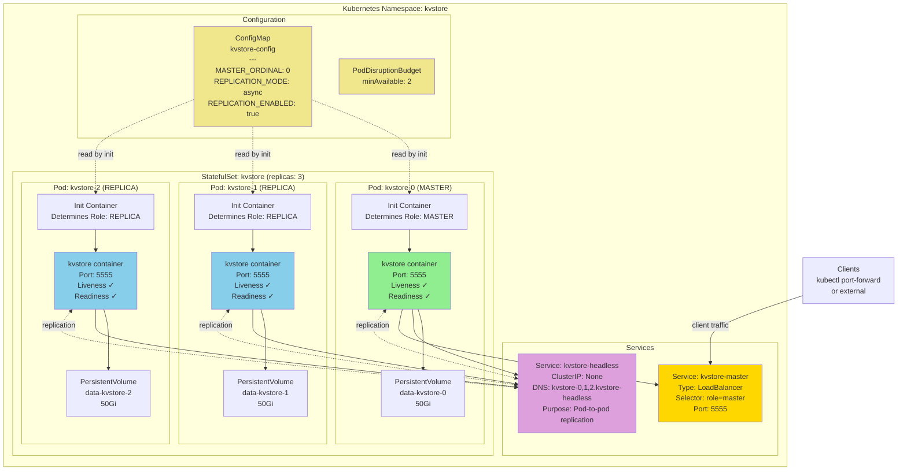

# Kubernetes Deployment Guide

## Overview

This guide covers deploying kvstore on Kubernetes with automatic failover capabilities. Kubernetes provides the infrastructure for detecting failures, restarting pods, and routing traffic to healthy nodes.

## Architecture on Kubernetes

### Deployment Model

- **StatefulSets**: Provides stable network identities and persistent storage for each pod
- **Headless Service**: Enables direct pod-to-pod communication for replication
- **Master Service**: Routes client traffic to the master node
- **PersistentVolumes**: Ensures data survives pod restarts
- **Health Probes**: Detects and automatically recovers from failures

### High Availability Features

✅ **Automatic Pod Restart**: Kubernetes automatically restarts crashed pods  
✅ **Data Persistence**: PersistentVolumes preserve data across restarts  
✅ **Health Monitoring**: Liveness and readiness probes detect failures  
✅ **Service Discovery**: DNS-based routing between pods  
⚠️ **Manual Master Promotion**: Requires ConfigMap update to change master

## Architecture Diagram



### Component Relationships

**ConfigMap → Pods:**
- Init containers read `MASTER_ORDINAL` to determine each pod's role
- Pods read `REPLICATION_MODE` and `REPLICATION_ENABLED` for configuration

**StatefulSet → Pods:**
- Creates 3 pods with stable names: `kvstore-0`, `kvstore-1`, `kvstore-2`
- Pod ordinal determines potential master status
- Ensures ordered creation and termination

**Pods → PersistentVolumes:**
- Each pod has its own 50Gi PersistentVolumeClaim
- Data survives pod restarts
- Volume reclaim policy preserves data

**Headless Service → Pods:**
- Provides DNS for each pod: `kvstore-{0,1,2}.kvstore-headless...`
- Enables direct pod-to-pod replication
- No load balancing (ClusterIP: None)

**Master Service → Master Pod:**
- Routes client traffic only to the master pod
- Uses label selector: `role=master`
- LoadBalancer exposes service externally

**PodDisruptionBudget → StatefulSet:**
- Ensures minimum 2 pods available during voluntary disruptions
- Protects against multiple simultaneous pod evictions

## Quick Start

### Prerequisites

- Kubernetes cluster (1.19+)
- kubectl configured
- 50GB+ storage available

### Deploy 3-Node Cluster

```bash
# Create namespace and deploy
kubectl create namespace kvstore
kubectl apply -f k8s/

# Wait for pods to be ready
kubectl get pods -n kvstore -w

# Expected output:
# kvstore-0   1/1   Running   0   2m
# kvstore-1   1/1   Running   0   2m
# kvstore-2   1/1   Running   0   2m
```

### Test the Deployment

```bash
# Port-forward to master
kubectl port-forward -n kvstore kvstore-0 5555:5555

# In another terminal, use client
python -m kvstore.cli.client_cli put testkey testvalue
python -m kvstore.cli.client_cli read testkey
```

## Kubernetes Manifests

All Kubernetes manifests are available in the [`k8s/`](../k8s/) directory:

- **[namespace.yaml](../k8s/namespace.yaml)** - Creates the `kvstore` namespace
- **[configmap.yaml](../k8s/configmap.yaml)** - Configuration for master ordinal and replication settings
- **[service-headless.yaml](../k8s/service-headless.yaml)** - Headless service for pod-to-pod communication
- **[service-master.yaml](../k8s/service-master.yaml)** - LoadBalancer service for client access
- **[statefulset.yaml](../k8s/statefulset.yaml)** - StatefulSet with 3 replicas, init containers, and probes
- **[pdb.yaml](../k8s/pdb.yaml)** - PodDisruptionBudget for availability
- **[networkpolicy.yaml](../k8s/networkpolicy.yaml)** - Network policies for security
- **[cronjob-backup.yaml](../k8s/cronjob-backup.yaml)** - Daily backup CronJob

See the [k8s/README.md](../k8s/README.md) for deployment instructions.

## Deployment Steps

### Deploy All Manifests

```bash
# Deploy all resources at once
kubectl apply -f k8s/

# Or deploy individually in order
kubectl apply -f k8s/namespace.yaml
kubectl apply -f k8s/configmap.yaml
kubectl apply -f k8s/service-headless.yaml
kubectl apply -f k8s/service-master.yaml
kubectl apply -f k8s/statefulset.yaml
kubectl apply -f k8s/pdb.yaml
kubectl apply -f k8s/networkpolicy.yaml

# Optional: Deploy backup CronJob
kubectl apply -f k8s/cronjob-backup.yaml

# Verify deployment
kubectl get all -n kvstore
```

### Using Docker Image

Build a Docker image for easier deployment using the provided [`Dockerfile`](../Dockerfile):

Build and push:

```bash
docker build -t yourregistry/kvstore:1.0 .
docker push yourregistry/kvstore:1.0
```

Then update `k8s/statefulset.yaml` to use your image:
```yaml
containers:
- name: kvstore
  image: yourregistry/kvstore:1.0  # Instead of python:3.11-slim
```

## Failover Scenarios

### Scenario 1: Master Pod Crashes

**What Happens:**
1. Master pod crashes or becomes unhealthy
2. Liveness probe fails after 3 attempts (~30 seconds)
3. Kubernetes terminates and recreates kvstore-0
4. New pod starts with same PersistentVolume (data preserved)
5. Init container detects it should be master
6. Pod starts as master and resumes operations

**Downtime:** ~30-60 seconds

**Manual Steps:** None required (automatic)

```bash
# Monitor the failover
kubectl get pods -n kvstore -w

# Check logs of new pod
kubectl logs -n kvstore kvstore-0
```

### Scenario 2: Replica Pod Crashes

**What Happens:**
1. Replica pod crashes
2. Kubernetes automatically restarts it
3. Pod rejoins cluster as replica
4. Master detects replica is back
5. Replication resumes automatically

**Impact:** None on availability, brief replication lag

### Scenario 3: Manual Master Promotion

To promote kvstore-1 to master:

```bash
# 1. Edit ConfigMap
kubectl edit configmap -n kvstore kvstore-config
# Change MASTER_ORDINAL from "0" to "1"

# 2. Delete all pods (StatefulSet will recreate with new roles)
kubectl delete pod -n kvstore kvstore-0 kvstore-1 kvstore-2

# 3. Wait for pods to restart
kubectl get pods -n kvstore -w

# 4. Verify new master
kubectl logs -n kvstore kvstore-1 | grep "Starting as MASTER"
```

**Downtime:** ~30-60 seconds during restart

### Scenario 4: Node Failure

**What Happens:**
1. Node hosting master fails
2. Kubernetes detects node failure (default: 5 minutes)
3. Pod evicted from failed node
4. Scheduled on healthy node
5. PersistentVolume reattaches
6. Pod starts with data preserved

**Downtime:** ~5-7 minutes (node detection + pod scheduling)

## Monitoring

### Check Pod Status

```bash
# List all pods
kubectl get pods -n kvstore

# Describe specific pod
kubectl describe pod -n kvstore kvstore-0

# Get pod events
kubectl get events -n kvstore --sort-by='.lastTimestamp'
```

### View Logs

```bash
# Follow logs from master
kubectl logs -f -n kvstore kvstore-0

# View logs from all pods
kubectl logs -n kvstore -l app=kvstore --tail=50

# Check init container logs
kubectl logs -n kvstore kvstore-0 -c init-kvstore
```

### Check Services

```bash
# List services
kubectl get svc -n kvstore

# Test connectivity to master service
kubectl run -it --rm debug --image=busybox --restart=Never -n kvstore -- \
  telnet kvstore-master 5555
```

### Storage Status

```bash
# Check PersistentVolumeClaims
kubectl get pvc -n kvstore

# Describe PVC
kubectl describe pvc -n kvstore data-kvstore-0

# Check storage usage
kubectl exec -n kvstore kvstore-0 -- df -h /data
```

## Production Best Practices

### 1. Use Fast Storage

Edit `k8s/statefulset.yaml` to use SSD-backed storage:

```yaml
volumeClaimTemplates:
- metadata:
    name: data
  spec:
    storageClassName: fast-ssd  # Use your SSD storage class
    accessModes: ["ReadWriteOnce"]
    resources:
      requests:
        storage: 100Gi
```

### 2. Adjust Resource Limits

Modify `k8s/statefulset.yaml` based on your workload:

```yaml
resources:
  requests:
    memory: "1Gi"
    cpu: "500m"
  limits:
    memory: "2Gi"
    cpu: "2000m"
```

### 3. Enable Pod Anti-Affinity

For production, use `requiredDuringSchedulingIgnoredDuringExecution` in `k8s/statefulset.yaml`:

```yaml
affinity:
  podAntiAffinity:
    requiredDuringSchedulingIgnoredDuringExecution:  # Stronger than preferred
    - labelSelector:
        matchExpressions:
        - key: app
          operator: In
          values:
          - kvstore
      topologyKey: kubernetes.io/hostname
```

### 4. Network Policies

Apply network policies for security (already included in `k8s/networkpolicy.yaml`):

```bash
kubectl apply -f k8s/networkpolicy.yaml
```

### 5. Backup Strategy

Deploy the backup CronJob (included in `k8s/cronjob-backup.yaml`):

```bash
# Create PVC for backups first
kubectl apply -f k8s/backup-pvc.yaml  # You'll need to create this

# Deploy backup CronJob
kubectl apply -f k8s/cronjob-backup.yaml
```

## Troubleshooting

### Pods Not Starting

```bash
# Check pod status
kubectl describe pod -n kvstore kvstore-0

# Common issues:
# - PVC not binding: Check storage class exists
# - Image pull errors: Verify image exists and credentials
# - Init container failures: Check init container logs
```

### Replication Not Working

```bash
# Check if replicas can reach master
kubectl exec -n kvstore kvstore-1 -- \
  nc -zv kvstore-0.kvstore-headless 5555

# Check DNS resolution
kubectl exec -n kvstore kvstore-1 -- \
  nslookup kvstore-0.kvstore-headless

# View master logs for replication errors
kubectl logs -n kvstore kvstore-0 | grep -i repl
```

### Data Loss After Restart

```bash
# Verify PVC is retained
kubectl get pvc -n kvstore

# Check if data directory has files
kubectl exec -n kvstore kvstore-0 -- ls -la /data

# If empty, check if correct PVC is mounted
kubectl describe pod -n kvstore kvstore-0 | grep -A 5 Volumes
```

### High Memory Usage

```bash
# Check current usage
kubectl top pods -n kvstore

# View detailed metrics
kubectl describe pod -n kvstore kvstore-0 | grep -A 10 Resources

# Increase limits if needed
kubectl edit statefulset -n kvstore kvstore
```

## Scaling

### Add More Replicas

```bash
# Scale to 5 replicas
kubectl scale statefulset -n kvstore kvstore --replicas=5

# Wait for new pods
kubectl get pods -n kvstore -w
```

**Note:** New replicas will start without updating master's replica list. For full integration, update ConfigMap and restart master.

### Remove Replicas

```bash
# Scale down to 3
kubectl scale statefulset -n kvstore kvstore --replicas=3

# PVCs are retained by default
kubectl get pvc -n kvstore
```

## Clean Up

```bash
# Delete all resources
kubectl delete namespace kvstore

# Or delete individually
kubectl delete statefulset -n kvstore kvstore
kubectl delete svc -n kvstore --all
kubectl delete pvc -n kvstore --all
kubectl delete configmap -n kvstore kvstore-config
```

## Limitations

1. **Manual Master Promotion**: Requires ConfigMap edit and pod restart
2. **No Automatic Failover**: Master doesn't automatically promote replica
3. **Split-Brain Risk**: Network partition could cause issues
4. **Fixed Cluster Size**: Adding replicas requires configuration update

## See Also

- [REPLICATION.md](REPLICATION.md) - Replication architecture and configuration
- [CONFIGURATION.md](CONFIGURATION.md) - Configuration parameters
- [tests/test_replication.py](../tests/test_replication.py) - Replication tests
