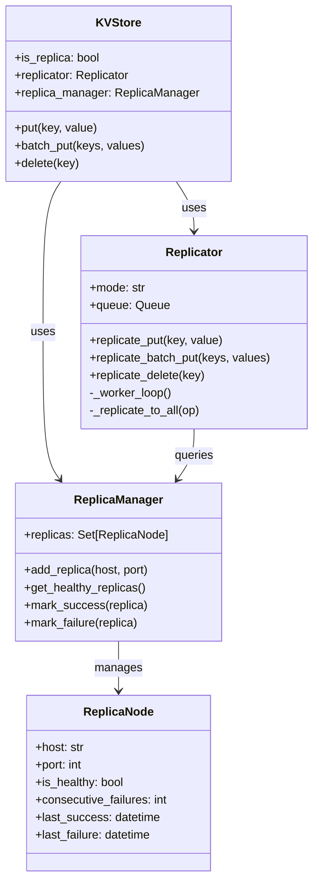
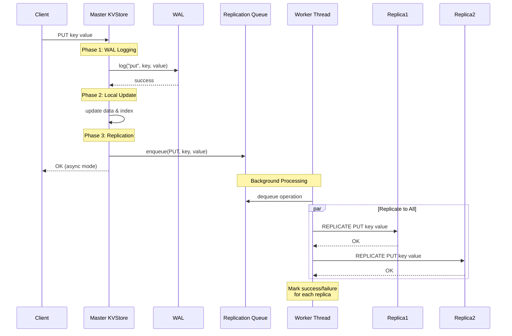

# Data Replication

## Overview

The kvstore supports **master-slave replication** to provide data redundancy and high availability. The master node handles all write operations and asynchronously replicates them to one or more replica nodes.

## Architecture

### Replication Model

- **Master-Slave Architecture**: One master node accepts writes, multiple replica nodes receive replicated data
- **Asynchronous by Default**: Operations are queued and replicated in the background for better write performance
- **Synchronous Mode Available**: Optional synchronous replication for stronger consistency guarantees
- **Automatic Retry**: Failed replications are automatically retried up to a configurable limit
- **Health Monitoring**: Replicas are monitored and marked unhealthy after consecutive failures

### Components

### Replication Flow

## Configuration

### Config Parameters

All replication settings are in `kvstore/utils/config.py`:

| Parameter | Type | Default | Description |
|-----------|------|---------|-------------|
| `REPLICATION_ENABLED` | bool | `False` | Enable/disable replication |
| `REPLICATION_MODE` | str | `'async'` | Replication mode: `'async'` or `'sync'` |
| `REPLICA_ADDRESSES` | list | `[]` | List of `(host, port)` tuples for replicas |
| `REPLICATION_MAX_RETRIES` | int | `3` | Max retry attempts per operation |
| `REPLICATION_QUEUE_SIZE` | int | `10000` | Max size of replication queue (async mode) |
| `REPLICATION_MAX_FAILURES` | int | `3` | Consecutive failures before marking unhealthy |
| `REPLICATION_HEALTH_CHECK_INTERVAL` | int | `30` | Seconds between health checks |
| `REPLICATION_TIMEOUT` | float | `5.0` | Socket timeout for replication (seconds) |

## Replication Protocol

### REPLICATE Commands

Master nodes send `REPLICATE` commands to replica nodes:

| Command | Format | Description |
|---------|--------|-------------|
| `REPLICATE PUT` | `REPLICATE PUT <key> <value>` | Replicate single key-value pair |
| `REPLICATE BATCHPUT` | `REPLICATE BATCHPUT <keys> <values>` | Replicate batch operation |
| `REPLICATE DELETE` | `REPLICATE DELETE <key>` | Replicate delete operation |

### Response Codes

- `OK` - Operation replicated successfully
- `ERROR: <message>` - Replication failed

**Note**: `REPLICATE` commands are only accepted by nodes started with `--replica` flag.

## Replication Modes

### Asynchronous Replication (Default)

**Characteristics**:
- ✅ **Fast writes**: Client gets response immediately after WAL + local update
- ✅ **High throughput**: Background workers handle replication
- ✅ **Non-blocking**: Write operations don't wait for replicas
- ⚠️ **Eventual consistency**: Small window where replicas may lag
- ⚠️ **Data loss risk**: If master crashes before replication completes

**Best for**:
- High write throughput requirements
- Read-heavy workloads
- Applications tolerating eventual consistency
- Non-critical data where small data loss is acceptable

### Synchronous Replication

**Characteristics**:
- ✅ **Strong consistency**: Replicas always in sync with master
- ✅ **No data loss**: Client only gets OK after replication succeeds
- ✅ **Guaranteed durability**: Data on multiple nodes before acknowledging
- ⚠️ **Slower writes**: Client waits for network round-trip to replicas
- ⚠️ **Lower throughput**: Write latency increases with replicas

**Best for**:
- Critical data requiring strong consistency
- Financial transactions
- Systems with strict durability requirements
- Low write volume applications

## Health Monitoring

### Automatic Health Checks

- Replicas are monitored passively based on replication success/failure
- After `REPLICATION_MAX_FAILURES` consecutive failures, replica marked unhealthy
- **Unhealthy replicas are skipped** for subsequent replications
- ⚠️ **Current Limitation**: Unhealthy replicas do **not** automatically recover
  - Once marked unhealthy, replica remains unhealthy until master restart
  - No active health checks or recovery mechanism in current implementation
- Replica health resets when master restarts and discovers replicas again

### Manual Recovery

To restore an unhealthy replica:
1. Fix the replica node issue (restart, network, etc.)
2. Restart the master node to reset replica health status
3. Alternative: Restart replica and manually sync missed data

## Failure Scenarios

### Replica Node Failure

**What happens**:
1. Master detects failure when trying to replicate
2. After 3 consecutive failures, replica marked unhealthy
3. Master continues operating, serving reads/writes normally
4. **Replica is permanently skipped** until manual intervention
5. Operations are not queued for that replica

**Recovery**:
- Fix the replica node (restart, fix network, etc.)
- Restart the **master node** to reset health monitoring
- Alternative: Manually sync missed data from master to replica
- ⚠️ **No automatic recovery** in current implementation

### Master Node Failure

**What happens**:
1. Master crashes, clients cannot write
2. Replicas have most recent data (async may have lag)
3. Manual failover required to promote replica

**Recovery**:
1. Stop failed master
2. Promote one replica to master
3. Reconfigure other replicas to point to new master
4. Update clients to connect to new master

### Network Partition

**What happens**:
1. Master cannot reach replicas
2. All replicas marked unhealthy after failures
3. Master continues serving locally
4. Replication queue grows (up to `REPLICATION_QUEUE_SIZE`)
5. If queue full, new operations dropped

**Recovery**:
- Network heals automatically
- Queued operations replicate to replicas
- Replicas marked healthy after success

## Limitations

Current implementation limitations:

1. **No Automatic Failover**: Replica promotion is manual
2. **No Automatic Recovery**: Unhealthy replicas don't auto-recover; require master restart
3. **Master-Slave Only**: No multi-master replication
4. **No Conflict Resolution**: Last-write-wins (not applicable with single master)
5. **No Cascading Replication**: Replicas cannot replicate to other replicas
6. **No Read Preference**: Client must explicitly choose master or replica
7. **No Partial Replication**: All data replicated, no filtering
8. **No Replication Lag Metrics**: Must implement custom monitoring
9. **No Active Health Checks**: Passive failure detection only

## Future Enhancements

Potential improvements for future versions:

- **Active health checks with automatic recovery** for unhealthy replicas
- Automatic failover and leader election
- Multi-master replication with conflict resolution
- Cascading replication (replica-to-replica)
- Built-in replication lag monitoring
- Selective replication (filter by key pattern)
- Compression for replication traffic
- TLS/SSL for secure replication
- Quorum-based consistency levels
