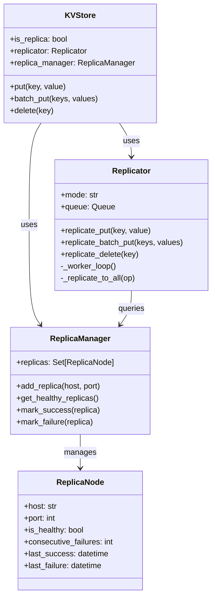
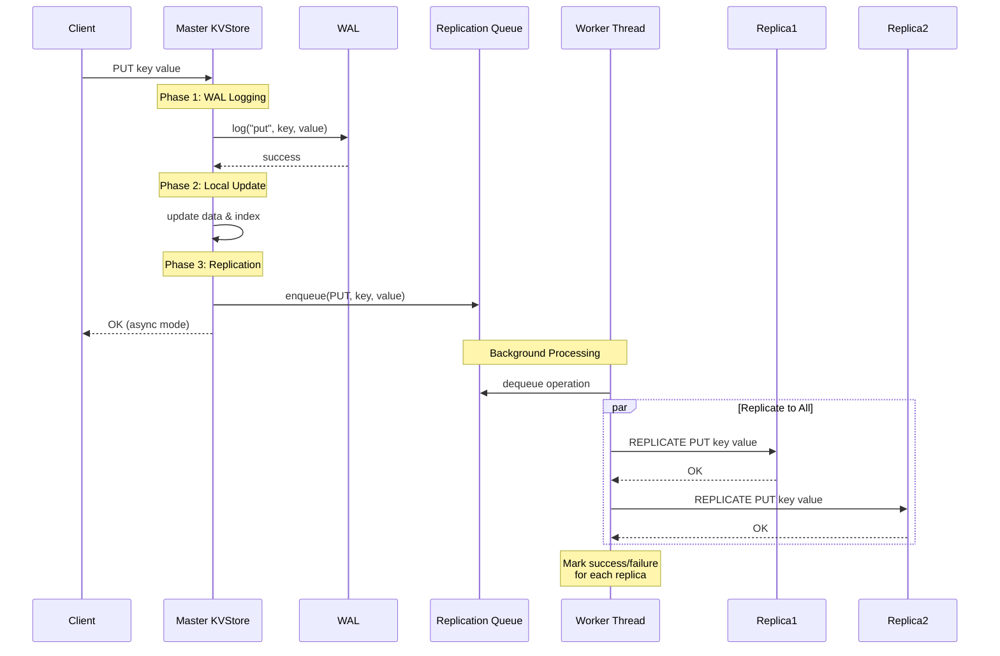

# Data Replication

## Overview

The kvstore supports **master-slave replication** to provide data redundancy and high availability. The master node handles all write operations and asynchronously replicates them to one or more replica nodes.

## Architecture

### Replication Model

- **Master-Slave Architecture**: One master node accepts writes, multiple replica nodes receive replicated data
- **Asynchronous by Default**: Operations are queued and replicated in the background for better write performance
- **Synchronous Mode Available**: Optional synchronous replication for stronger consistency guarantees
- **Automatic Retry**: Failed replications are automatically retried up to a configurable limit
- **Health Monitoring**: Replicas are monitored and marked unhealthy after consecutive failures

### Components



### Replication Flow



## Configuration

### Config Parameters

All replication settings are in `kvstore/utils/config.py`:

| Parameter | Type | Default | Description |
|-----------|------|---------|-------------|
| `REPLICATION_ENABLED` | bool | `False` | Enable/disable replication |
| `REPLICATION_MODE` | str | `'async'` | Replication mode: `'async'` or `'sync'` |
| `REPLICA_ADDRESSES` | list | `[]` | List of `(host, port)` tuples for replicas |
| `REPLICATION_MAX_RETRIES` | int | `3` | Max retry attempts per operation |
| `REPLICATION_QUEUE_SIZE` | int | `10000` | Max size of replication queue (async mode) |
| `REPLICATION_MAX_FAILURES` | int | `3` | Consecutive failures before marking unhealthy |
| `REPLICATION_HEALTH_CHECK_INTERVAL` | int | `30` | Seconds between health checks |
| `REPLICATION_TIMEOUT` | float | `5.0` | Socket timeout for replication (seconds) |

### Programmatic Configuration

```python
from kvstore.utils.config import Config
from kvstore.network.server import KVServer

# Configure replication
Config.REPLICATION_ENABLED = True
Config.REPLICATION_MODE = 'async'
Config.REPLICA_ADDRESSES = [
    ('replica1.example.com', 5556),
    ('replica2.example.com', 5557),
]

# Start master server
master = KVServer(host='0.0.0.0', port=5555, is_replica=False)
master.start()
```

### CLI Configuration

#### Master Node with Replicas

```bash
# Start master with two replicas in async mode
python -m kvstore.cli.server_cli \
  --host 0.0.0.0 \
  --port 5555 \
  --replicas localhost:5556,localhost:5557 \
  --replication-mode async

# Start master with synchronous replication
python -m kvstore.cli.server_cli \
  --host 0.0.0.0 \
  --port 5555 \
  --replicas localhost:5556,localhost:5557 \
  --replication-mode sync
```

#### Replica Nodes

```bash
# Start first replica
python -m kvstore.cli.server_cli \
  --host 0.0.0.0 \
  --port 5556 \
  --data-dir ./replica1_data \
  --replica

# Start second replica
python -m kvstore.cli.server_cli \
  --host 0.0.0.0 \
  --port 5557 \
  --data-dir ./replica2_data \
  --replica
```

## Usage Examples

### Basic Setup

1. **Start Replica Nodes First**:
```bash
# Terminal 1 - Replica 1
python -m kvstore.cli.server_cli --port 5556 --data-dir ./replica1 --replica

# Terminal 2 - Replica 2
python -m kvstore.cli.server_cli --port 5557 --data-dir ./replica2 --replica
```

2. **Start Master Node**:
```bash
# Terminal 3 - Master
python -m kvstore.cli.server_cli --port 5555 --replicas localhost:5556,localhost:5557
```

3. **Use Client Normally**:
```bash
# All operations go to master
python -m kvstore.cli.client_cli put mykey myvalue
python -m kvstore.cli.client_cli read mykey

# Check replica has the data
python -m kvstore.cli.client_cli --port 5556 read mykey
```

### Production Setup

#### Three-Node Cluster

```bash
# Node 1 - Master (server1.prod)
python -m kvstore.cli.server_cli \
  --host 0.0.0.0 \
  --port 5555 \
  --data-dir /var/lib/kvstore/master \
  --replicas server2.prod:5555,server3.prod:5555 \
  --replication-mode async

# Node 2 - Replica 1 (server2.prod)
python -m kvstore.cli.server_cli \
  --host 0.0.0.0 \
  --port 5555 \
  --data-dir /var/lib/kvstore/replica1 \
  --replica

# Node 3 - Replica 2 (server3.prod)
python -m kvstore.cli.server_cli \
  --host 0.0.0.0 \
  --port 5555 \
  --data-dir /var/lib/kvstore/replica2 \
  --replica
```

## Replication Protocol

### REPLICATE Commands

Master nodes send `REPLICATE` commands to replica nodes:

| Command | Format | Description |
|---------|--------|-------------|
| `REPLICATE PUT` | `REPLICATE PUT <key> <value>` | Replicate single key-value pair |
| `REPLICATE BATCHPUT` | `REPLICATE BATCHPUT <keys> <values>` | Replicate batch operation |
| `REPLICATE DELETE` | `REPLICATE DELETE <key>` | Replicate delete operation |

### Response Codes

- `OK` - Operation replicated successfully
- `ERROR: <message>` - Replication failed

**Note**: `REPLICATE` commands are only accepted by nodes started with `--replica` flag.

## Replication Modes

### Asynchronous Replication (Default)

**Characteristics**:
- ✅ **Fast writes**: Client gets response immediately after WAL + local update
- ✅ **High throughput**: Background workers handle replication
- ✅ **Non-blocking**: Write operations don't wait for replicas
- ⚠️ **Eventual consistency**: Small window where replicas may lag
- ⚠️ **Data loss risk**: If master crashes before replication completes

**Best for**:
- High write throughput requirements
- Read-heavy workloads
- Applications tolerating eventual consistency
- Non-critical data where small data loss is acceptable

**Example**:
```python
Config.REPLICATION_MODE = 'async'
```

### Synchronous Replication

**Characteristics**:
- ✅ **Strong consistency**: Replicas always in sync with master
- ✅ **No data loss**: Client only gets OK after replication succeeds
- ✅ **Guaranteed durability**: Data on multiple nodes before acknowledging
- ⚠️ **Slower writes**: Client waits for network round-trip to replicas
- ⚠️ **Lower throughput**: Write latency increases with replicas

**Best for**:
- Critical data requiring strong consistency
- Financial transactions
- Systems with strict durability requirements
- Low write volume applications

**Example**:
```python
Config.REPLICATION_MODE = 'sync'
```

## Health Monitoring

### Automatic Health Checks

- Replicas are monitored passively based on replication success/failure
- After `REPLICATION_MAX_FAILURES` consecutive failures, replica marked unhealthy
- Unhealthy replicas are skipped for subsequent replications
- Replica marked healthy again after first successful replication

### Health Status

```python
# Get replication status (programmatic access)
if server.store.replicator:
    stats = server.store.replicator.get_stats()
    print(f"Successful replications: {stats['successful_replications']}")
    print(f"Failed replications: {stats['failed_replications']}")
    print(f"Queue size: {stats['queue_size']}")
    
    replica_status = server.store.replica_manager.get_status()
    print(f"Healthy replicas: {replica_status['healthy_replicas']}/{replica_status['total_replicas']}")
```

## Failure Scenarios

### Replica Node Failure

**What happens**:
1. Master detects failure when trying to replicate
2. After 3 consecutive failures, replica marked unhealthy
3. Master continues operating, serving reads/writes normally
4. Operations queued for retry (up to max retries)
5. When replica recovers, operations resume

**Recovery**:
- Restart replica node
- First successful replication marks it healthy again
- Missed operations may need manual sync (see Recovery section)

### Master Node Failure

**What happens**:
1. Master crashes, clients cannot write
2. Replicas have most recent data (async may have lag)
3. Manual failover required to promote replica

**Recovery**:
1. Stop failed master
2. Promote one replica to master
3. Reconfigure other replicas to point to new master
4. Update clients to connect to new master

### Network Partition

**What happens**:
1. Master cannot reach replicas
2. All replicas marked unhealthy after failures
3. Master continues serving locally
4. Replication queue grows (up to `REPLICATION_QUEUE_SIZE`)
5. If queue full, new operations dropped

**Recovery**:
- Network heals automatically
- Queued operations replicate to replicas
- Replicas marked healthy after success

## Performance Characteristics

### Async Mode Performance

| Operation | Master Latency | Notes |
|-----------|---------------|-------|
| PUT | ~1-2ms | WAL + local update only |
| BATCH_PUT | ~2-5ms | Depends on batch size |
| READ | <1ms | No replication overhead |
| DELETE | ~1-2ms | WAL + index update only |

**Replication lag**: Typically 10-50ms depending on network

### Sync Mode Performance

| Operation | Master Latency | Notes |
|-----------|---------------|-------|
| PUT | ~5-20ms | Includes replica round-trip |
| BATCH_PUT | ~10-50ms | Multiplied by batch size |
| READ | <1ms | No replication overhead |
| DELETE | ~5-20ms | Includes replica round-trip |

**Factors affecting latency**:
- Network latency to replicas
- Number of replicas
- Replica load

### Scalability

- **Write throughput**: Limited by master node (single writer)
- **Read throughput**: Scales linearly with replicas (read from replicas)
- **Replication overhead**: ~10-20% CPU on master (async mode)
- **Network bandwidth**: Each write operation sent to N replicas

## Advanced Topics

### Manual Replica Synchronization

If a replica falls too far behind, manual sync may be needed:

```bash
# 1. Stop replica
# 2. Copy data files from master
scp master:/var/lib/kvstore/master/*.db replica:/var/lib/kvstore/replica/

# 3. Restart replica
python -m kvstore.cli.server_cli --port 5556 --data-dir /var/lib/kvstore/replica --replica
```

### Monitoring Replication Lag

```python
# Custom monitoring script
import socket
import time

def check_replication():
    # Write to master with timestamp
    master = socket.create_connection(('master', 5555))
    timestamp = str(time.time()).encode()
    master.sendall(b'PUT repl_check ' + timestamp + b'\n')
    master.recv(1024)
    master.close()
    
    # Read from replica
    time.sleep(0.1)  # Allow replication
    replica = socket.create_connection(('replica', 5556))
    replica.sendall(b'READ repl_check\n')
    result = replica.recv(1024)
    replica.close()
    
    if result == timestamp:
        print("Replica in sync")
    else:
        print("Replica lagging")

check_replication()
```

### Read from Replicas

To distribute read load, configure clients to read from replicas:

```python
from kvstore.network.client import KVClient

# Write to master
master_client = KVClient(host='master', port=5555)
master_client.put('mykey', 'myvalue')

# Read from replica (eventual consistency)
replica_client = KVClient(host='replica1', port=5556)
value = replica_client.read('mykey')  # May lag slightly in async mode
```

## Best Practices

### Production Recommendations

1. **Use Async Mode**: For most workloads, async provides best performance
2. **Monitor Health**: Implement monitoring for replica health status
3. **Network Reliability**: Ensure stable network between master and replicas
4. **Replica Capacity**: Size replicas same as master for failover capability
5. **Regular Backups**: Replication is not a backup solution
6. **Test Failover**: Practice promoting replicas to master
7. **Geographic Distribution**: Consider network latency when placing replicas

### Configuration Tuning

```python
# High-throughput workload
Config.REPLICATION_QUEUE_SIZE = 100000  # Large queue
Config.REPLICATION_MAX_RETRIES = 5      # More retries
Config.REPLICATION_TIMEOUT = 2.0        # Lower timeout

# Strong consistency workload
Config.REPLICATION_MODE = 'sync'
Config.REPLICATION_TIMEOUT = 10.0       # Higher timeout
Config.REPLICATION_MAX_FAILURES = 1     # Strict health checks

# Network-constrained environment
Config.REPLICATION_TIMEOUT = 30.0       # Generous timeout
Config.REPLICATION_MAX_FAILURES = 10    # Tolerate flaky network
```

## Troubleshooting

### Replica Not Receiving Updates

**Symptoms**: Replica data doesn't match master

**Checks**:
1. Verify replica is running with `--replica` flag
2. Check master logs for replication errors
3. Verify network connectivity: `telnet replica_host replica_port`
4. Check replica is marked healthy in master

**Solution**:
```bash
# Check if replica accepts connections
telnet localhost 5556

# Manual test replication command
echo "REPLICATE PUT testkey testvalue" | nc localhost 5556
# Should return "OK"
```

### Replication Queue Full

**Symptoms**: Master logs show "Queue full, dropped operation"

**Cause**: Replicas too slow or unreachable, queue filled up

**Solution**:
```python
# Increase queue size
Config.REPLICATION_QUEUE_SIZE = 100000  # Default: 10000

# Or reduce retry limit to free queue faster
Config.REPLICATION_MAX_RETRIES = 1  # Default: 3
```

### High Replication Lag

**Symptoms**: Replicas significantly behind master

**Causes**:
- Network latency
- Replica overloaded
- Insufficient worker threads

**Solution**:
```python
# Increase worker threads in Replicator.__init__
self.num_workers = 4  # Default: 2
```

## Limitations

Current implementation limitations:

1. **No Automatic Failover**: Replica promotion is manual
2. **Master-Slave Only**: No multi-master replication
3. **No Conflict Resolution**: Last-write-wins (not applicable with single master)
4. **No Cascading Replication**: Replicas cannot replicate to other replicas
5. **No Read Preference**: Client must explicitly choose master or replica
6. **No Partial Replication**: All data replicated, no filtering
7. **No Replication Lag Metrics**: Must implement custom monitoring

## Future Enhancements

Potential improvements for future versions:

- Automatic failover and leader election
- Multi-master replication with conflict resolution
- Cascading replication (replica-to-replica)
- Built-in replication lag monitoring
- Selective replication (filter by key pattern)
- Compression for replication traffic
- TLS/SSL for secure replication
- Quorum-based consistency levels
